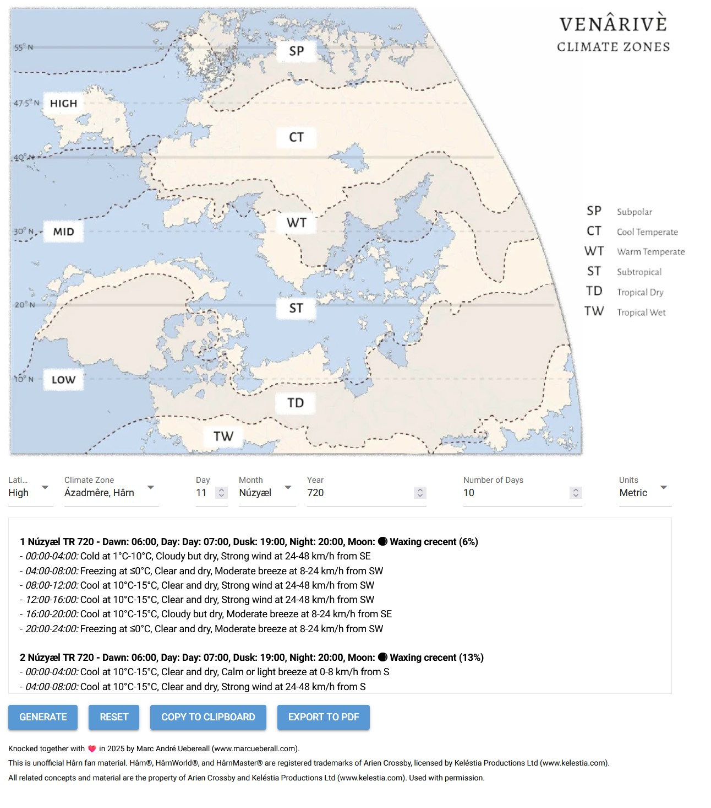

# harn-weather-generator

**NOTE:** Consider this project as deprecated. It is replaced with the obsidian.md plugin https://github.com/marcueberall/obsidian-harn-weather. It is currently in peer review and will hopefully be found in the community plugins within obsidian.md.

A weather generator for the HârnMaster: Roleplaying in the World of Kèthîra rule system.

## Installation
You can either clone it via git by using the command

```git clone https://github.com/marcueberall/harn-weather-generator.git```

or simply download the zip file from the upper right 'code' button.

Make sure you have Python installed and run

```python -m pip install nicegui```

## Execution
Run the web app using the following command from your cli/cmd/terminal window.

```python main.py```

## Usage
You can set the latitude, climate zone for the region you want to generate the weather for using the drop down boxes. For easier referencing, you can look-up the corresponding values from the map above.

Then you can specify the date and the number of days to generate the weather for. The resulting weather information is formatted in simple markdown style.



## Disclaimer
This is unofficial Hârn fan material. Hârn®, HârnWorld®, and HârnMaster® are registered trademarks of Arien Crossby, licensed by Keléstia Productions Ltd (www.kelestia.com). All related concepts and material are the property of Arien Crossby and Keléstia Productions Ltd (www.kelestia.com). Used with permission.
